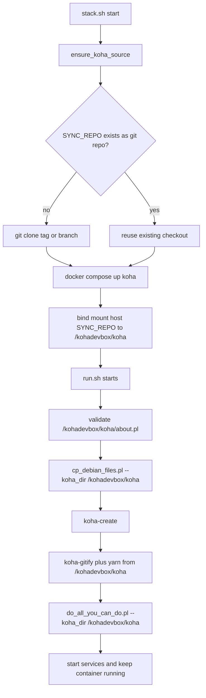

<!-- markdownlint-disable MD032 -->

# Koha Source Code Lifecycle Report

## Scope

This report explains, in execution order:

1. When the Koha source code is obtained.
2. Where it is stored on host and inside containers.
3. At which startup and installation steps that source tree is used.
4. What this means for upgrades and Alpine migration work.

Primary files analyzed:
- stack manager: `stack.sh`
- container composition: `docker-compose.yml`
- Koha image build: `Dockerfile`
- Koha runtime entrypoint: `files/run.sh`

---

## Executive Summary

The Koha source tree is prepared before the Koha container starts, then bind-mounted into the container as the live working copy, and consumed repeatedly through the full initialization pipeline.

Key points:

- Source bootstrap happens on the host via `ensure_koha_source()`.
- Runtime source path in the container is `/kohadevbox/koha`.
- `run.sh` exits early if that source tree is missing/invalid.
- Core setup scripts (`cp_debian_files.pl`, `koha-create`, `do_all_you_can_do.pl`, `koha-gitify`, `yarn install`) all use that mounted source.
- Source code changes on host are immediately visible in container because of bind mount.
- Entrypoint script changes are different: `run.sh` is image-baked and needs image rebuild.

---

## 1) Where Source Comes From (Host Phase)

## 1.1 Source root variable

The stack manager reads source location from `SYNC_REPO` in environment (`env/.env`) with fallback to `<repo>/koha`.

## 1.2 Source auto-clone logic

Before start/build/restart/restore paths that need Koha source, `stack.sh` calls `ensure_koha_source()`.

Behavior:

- If `SYNC_REPO/.git` exists: uses it as-is.
- If missing: performs shallow clone based on configured mode.
  - tag mode: clone resolved tag from `KOHA_GIT_TAG`.
  - branch mode: clone from `KOHA_GIT_BRANCH`.

Operational result:

- The project initialization can be fully automated on a clean machine.
- First source usage starts before any Koha container runtime step.

---

## 2) Where Source Lives in the Container

## 2.1 Bind mount location

Compose mounts host source path into Koha container:

- host: `${SYNC_REPO}`
- container: `/kohadevbox/koha`

This is a live bind mount, not a one-time copy.

## 2.2 Dockerfile declaration context

The image declares a `VOLUME /kohadevbox/koha`, but at runtime the compose bind mount is what supplies the actual source tree.

Operational result:

- The container always executes against the host source checkout.
- Code edits on host are reflected immediately in container filesystem view.

---

## 3) Detailed Timeline: How Source Is Used During Initialization

## Phase A: stack startup orchestration

1. `stack.sh start` begins.
2. `ensure_koha_source()` validates or clones source tree.
3. Services are started (Traefik/OpenSearch/support).
4. Koha container is created with bind-mounted source.

Source is first required in step 2.

## Phase B: run.sh early validation

At container entrypoint start:

- `run.sh` checks `/kohadevbox/koha/about.pl`.
- If absent, it exits with error indicating invalid source path (`SYNC_REPO`).

This is the hard gate proving source must be available before any install logic proceeds.

## Phase C: dependency and template prep using source

`run.sh` can use source for dependency management:

- optional Perl dependency install from Koha cpanfile (`/kohadevbox/koha`).

It then executes:

- `misc4dev/cp_debian_files.pl --koha_dir /kohadevbox/koha`

Purpose:

- Prepare Koha/debian-derived files and instance templates based on the mounted source tree.

## Phase D: instance creation and config wiring

`run.sh` calls `koha-create` after source/template prep.

While `koha-create` itself is from koha-common tooling, it operates in a context prepared from source-linked templates and variables.

## Phase E: git integration and frontend assets from source

`run.sh` uses source tree directly for:

- git safe-directory and hook setup on `/kohadevbox/koha`
- `koha-gitify` invocation pointing to `/kohadevbox/koha`
- copying `package.json` and `yarn.lock` from `/kohadevbox/koha`
- running `yarn install` for JS dependencies used by Koha frontend/tooling

## Phase F: install/upgrade path over source tree

Before the main installer call, `run.sh` normalizes migration scripts under:

- `/kohadevbox/koha/misc/migration_tools`

Then it runs:

- `do_all_you_can_do.pl --koha_dir /kohadevbox/koha`

This is the main schema/bootstrap/upgrade orchestration path. The source tree is an explicit argument, so this phase is source-driven.

## Phase G: post-install runtime normalization

After installer execution, `run.sh` normalizes line endings across web entry points under the source tree (`*.pl`, `*.cgi`) before final service startup.

---

## 4) Source Usage Matrix by Component

## stack.sh

Uses source to:

- discover or clone it (`ensure_koha_source`)
- guarantee source exists before Koha container startup

## docker-compose.yml

Uses source to:

- mount host source into container at fixed runtime path

## Dockerfile

Uses source indirectly to:

- define expected mount point (`VOLUME /kohadevbox/koha`)
- prepare environment that expects mounted source during runtime

## files/run.sh

Uses source to:

- validate startup precondition (`about.pl` check)
- install optional dependencies from Koha cpanfile
- generate instance/debian artifacts via `cp_debian_files.pl`
- configure git/dev workflow around live source tree
- install frontend dependencies from Koha source manifests
- run installation/upgrade logic against explicit `--koha_dir`
- normalize migration/web scripts in source tree

---

## 5) Command-Specific Behavior

## start

- Ensures source exists.
- Starts Koha container and consumes source throughout full initialization.

## build --build-koha

- Ensures source exists before build path that targets Koha image.
- Note: image build itself does not copy the Koha source checkout into final runtime path used by startup; runtime still uses bind mount.

## restart

- Also ensures source path is present via stack path.
- Recreates Koha runtime with same mounted source location.

## restore

- Restores env files and DB, then ensures source and brings stack back up, again using bind-mounted source.

---

## 6) Practical Implications

## 6.1 What changes take effect immediately

Host edits under source tree (`SYNC_REPO`) are immediately visible in container because runtime uses bind mount.

Examples:

- Perl modules/scripts under Koha source
- templates/assets in source tree
- migration scripts

## 6.2 What requires image rebuild

Changes to files baked into image require rebuild, notably:

- `files/run.sh`
- image-layer templates/hooks copied in Dockerfile

This distinction is critical during troubleshooting and migration testing.

## 6.3 Failure modes related to source lifecycle

1. Wrong `SYNC_REPO` path: startup fails early at `about.pl` check.
2. Non-git directory at `SYNC_REPO`: `ensure_koha_source()` fails.
3. Ownership/permissions mismatch on bind-mounted source: later setup steps under instance user can fail.

---

## 7) Alpine Migration Relevance

For Ubuntu to Alpine container migration, source lifecycle remains conceptually identical:

- host source bootstrap
- bind mount to `/kohadevbox/koha`
- runtime setup/install against that path

What changes in Alpine work is not source lifecycle ordering, but compatibility of surrounding toolchain (service wrappers, package manager expectations, koha-common integration).

This means source-handling assumptions in current process can largely be preserved while porting OS-specific runtime logic.

---

## 8) Sequence Diagram

---

## 9) Reference Anchors

Key implementation anchors:

- source path variable and source bootstrap: `stack.sh`
- runtime bind mount: `docker-compose.yml`
- mount point declaration: `Dockerfile`
- entrypoint source usage timeline: `files/run.sh`
